# CEX Listing Workflow — ATOS (Autonomous Token Orchestration System)

> **Status**: Design & Architecture — Not yet implemented. This document demonstrates full understanding of the end-to-end CEX onboarding pipeline and how ATOS agents will automate it.

---

## Overview

Getting an ERC-20 token listed on a centralized exchange (CEX) is not a single action — it is a multi-phase compliance, documentation, and integration pipeline. ATOS is designed to automate the majority of this pipeline through its multi-agent system. The **Governance Agent** is the primary actor, but it coordinates with the **Monitor Agent** (for on-chain analytics) and **Deployer Agent** (for contract verification artifacts) to produce a fully content-addressed **Listing Package** — a DAG of IPLD nodes each identified by a CID.

---

## Full Workflow Diagram

> **Tip:** paste the diagram block below into **[mermaid.live](https://mermaid.live)** to render and download a PNG / SVG.

### Diagram — CEX Listing Pipeline (end to end)

Shows the complete seven-phase journey from a user triggering a `generate_cex_metadata` task on the dashboard all the way through exchange approval, trading pair launch, and post-listing monitoring. Each phase is colour-coded to distinguish agent responsibilities: cyan for on-chain readiness, purple for artifact generation, green for IPLD package assembly, amber for submission, red for due diligence, and back to cyan and green for launch and ongoing monitoring.

```mermaid
flowchart TD
    START(["👤 Operator triggers generate_cex_metadata\nfrom ATOS Dashboard"])

    %% ── PHASE 1 ────────────────────────────────────────────────
    subgraph P1["① ON-CHAIN READINESS VERIFICATION"]
        GOV1["🟣 Governance Agent\npicks up task from atos/tasks gossipsub"]
        CHK{"Contract deployed\n& source-verified?"}
        DEP["🔵 Deployer Agent\nDeploy + verify on Etherscan / Blockscout"]
        MON["🟢 Monitor Agent\npulls on-chain analytics snapshot"]
        SNAP[/"Holder count · 30d transfer volume\nDEX liquidity depth · Contract age"/]
    end

    %% ── PHASE 2 ────────────────────────────────────────────────
    subgraph P2["② ARTIFACT GENERATION  ·  Governance Agent"]
        subgraph A2M["Token Metadata"]
            GM["Generate metadata JSON\nname · symbol · supply · chain · logo"]
            MCID[/"🔗 CID_metadata\nDAG-JSON  SHA2-256"/]
        end
        subgraph A2A["Analytics Report"]
            GA["Generate analytics JSON\nholders · volume · DEX liquidity · age"]
            ACID[/"🔗 CID_analytics\nDAG-JSON  SHA2-256"/]
        end
        subgraph A2C["Compliance Declaration"]
            GC["Generate compliance JSON\nKYC · jurisdiction · audit · PQC status"]
            CCID[/"🔗 CID_compliance\nDAG-JSON  SHA2-256"/]
        end
    end

    %% ── PHASE 3 ────────────────────────────────────────────────
    subgraph P3["③ IPLD LISTING PACKAGE ASSEMBLY"]
        PKG["🧩 ListingPackageNode\nmetadata_cid · analytics_cid · compliance_cid\nlogo_cid · whitepaper_cid · peer_id · schema_v1"]
        RCID[/"🔗 ROOT CID\nSingle canonical identifier for this submission"/]
        PUB["🟣 Governance Agent\npublishes ROOT CID to atos/status"]
        DASH["📺 Dashboard — CEX Prep tab\nrenders all artifact CIDs + status"]
    end

    %% ── PHASE 4 ────────────────────────────────────────────────
    subgraph P4["④ EXCHANGE SUBMISSION"]
        SUB{"Submission\nmethod"}
        API["POST listing-package.json\nto CEX Listing API endpoint"]
        EXP["User downloads\nlisting-package.json from Dashboard"]
        ACK["✅ CEX Acknowledgement\n+ Application ID received"]
    end

    %% ── PHASE 5 ────────────────────────────────────────────────
    subgraph P5["⑤ DUE DILIGENCE  ·  CEX Side"]
        LEGAL["⚖️ Legal & Compliance\nKYC · Jurisdiction · Disclosure"]
        TECH["🔍 Technical Review\nContract audit · Bytecode · ERC-20 checks"]
        BIZ["📈 Business Review\nHolder count · DEX activity · Market demand"]
        OUT{"Outcome"}
        REV["🟣 Governance Agent\nUpdate artifact · Recompute CID\nNew Root CID links previous submission"]
        REJ(["❌ Rejection logged\nReason stored as CID in agent state"])
        APP["🎉 Listing confirmed by Exchange"]
    end

    %% ── PHASE 6 ────────────────────────────────────────────────
    subgraph P6["⑥ INTEGRATION & LAUNCH"]
        PAIRS["Configure trading pairs\nATOS/USDT · ATOS/BTC · ATOS/ETH"]
        LIQ["Set up market maker\nor seed initial liquidity"]
        ARB["🟢 Monitor Agent\nDEX ↔ CEX spread tracking\nUniswap V3 price vs CEX price"]
        LIVE(["🚀 Listing goes live\nRoot CID published as provenance\nPublic announcement"])
    end

    %% ── PHASE 7 ────────────────────────────────────────────────
    subgraph P7["⑦ POST-LISTING MONITORING"]
        POLL["🟢 Monitor Agent\ncontinuous on-chain polling"]
        MET[/"CEX withdrawal patterns · Holder distribution\nDEX spread alerts · Abnormal volume detection"/]
        RPT["🟣 Governance Agent\nWeekly compliance report CID\npublished to atos/status"]
    end

    %% ── EDGES ──────────────────────────────────────────────────
    START --> GOV1
    GOV1 --> CHK
    CHK -- "No" --> DEP
    DEP --> CHK
    CHK -- "Yes" --> MON
    MON --> SNAP

    SNAP --> GM & GA & GC
    GM --> MCID
    GA --> ACID
    GC --> CCID

    MCID & ACID & CCID --> PKG
    PKG --> RCID
    RCID --> PUB
    PUB --> DASH

    DASH --> SUB
    SUB -- "Automated API" --> API
    SUB -- "Manual export" --> EXP
    API & EXP --> ACK

    ACK --> LEGAL & TECH & BIZ
    LEGAL & TECH & BIZ --> OUT
    OUT -- "Revisions required" --> REV
    REV --> ACK
    OUT -- "Rejected" --> REJ
    OUT -- "Approved" --> APP

    APP --> PAIRS & LIQ
    PAIRS & LIQ --> ARB
    ARB --> LIVE

    LIVE --> POLL
    POLL --> MET
    MET --> RPT

    %% ── NODE STYLES ─────────────────────────────────────────────
    style START      fill:#0d1117,stroke:#00d4ff,stroke-width:2px,color:#e2e8f0
    style SNAP       fill:#0d1117,stroke:#00d4ff,stroke-width:1.5px,color:#93c5fd
    style MET        fill:#0d1117,stroke:#00d4ff,stroke-width:1.5px,color:#93c5fd
    style MCID       fill:#0d1117,stroke:#7c3aed,stroke-width:1.5px,color:#c4b5fd
    style ACID       fill:#0d1117,stroke:#7c3aed,stroke-width:1.5px,color:#c4b5fd
    style CCID       fill:#0d1117,stroke:#7c3aed,stroke-width:1.5px,color:#c4b5fd
    style RCID       fill:#0d1117,stroke:#10b981,stroke-width:2px,color:#6ee7b7
    style PKG        fill:#0d1117,stroke:#10b981,stroke-width:2px,color:#e2e8f0
    style APP        fill:#0d1117,stroke:#10b981,stroke-width:2px,color:#6ee7b7
    style LIVE       fill:#0d1117,stroke:#10b981,stroke-width:2px,color:#6ee7b7
    style REJ        fill:#0d1117,stroke:#ef4444,stroke-width:2px,color:#fca5a5
    style ACK        fill:#0d1117,stroke:#f59e0b,stroke-width:2px,color:#fcd34d

    %% ── SUBGRAPH STYLES — light tints so connecting lines are visible ──
    style P1  fill:#e8f4ff,stroke:#00d4ff,stroke-width:1.5px,color:#0d1117
    style P2  fill:#f5f0ff,stroke:#7c3aed,stroke-width:1.5px,color:#0d1117
    style P3  fill:#f0fdf4,stroke:#10b981,stroke-width:1.5px,color:#0d1117
    style P4  fill:#fffbeb,stroke:#f59e0b,stroke-width:1.5px,color:#0d1117
    style P5  fill:#fff1f2,stroke:#ef4444,stroke-width:1.5px,color:#0d1117
    style P6  fill:#e8f4ff,stroke:#00d4ff,stroke-width:1.5px,color:#0d1117
    style P7  fill:#f0fdf4,stroke:#10b981,stroke-width:1.5px,color:#0d1117
    style A2M fill:#ede9fe,stroke:#7c3aed,stroke-width:1px,color:#0d1117
    style A2A fill:#ede9fe,stroke:#7c3aed,stroke-width:1px,color:#0d1117
    style A2C fill:#ede9fe,stroke:#7c3aed,stroke-width:1px,color:#0d1117
```



The diagram flows top to bottom across seven numbered phases. Cyan borders mark on-chain and monitoring work owned by the Deployer and Monitor agents. Purple borders mark artifact generation and governance decisions owned by the Governance Agent. Green borders mark IPLD assembly, launch, and post-listing health. Amber marks the exchange submission gate. Red marks the CEX due diligence loop. Parallelogram nodes represent data payloads and CIDs. Diamond nodes are decision points. Rounded rectangles are terminal states. The three artifact streams in Phase 2 run in parallel before converging into the single root CID in Phase 3.

---

## Phase-by-Phase Explanation

### Phase 1 — On-Chain Readiness Verification

The workflow starts when a user submits a `generate_cex_metadata` task from the ATOS dashboard. This task is published to the `atos/tasks` Gossipsub topic and picked up by the Governance Agent.

Before generating any artifacts, the Governance Agent coordinates with the other two agents to confirm the system is in a verifiable state:

- **Deployer Agent check**: Confirms the ERC-20 contract is deployed and source-verified on the target chain (Sepolia / Filecoin Calibration). If not, it triggers a deployment + Etherscan/Blockscout verification flow first.
- **Monitor Agent snapshot**: Pulls a real-time analytics snapshot — holder count, 30-day transfer volume, current DEX liquidity depth (from the Uniswap V3 pool), and contract age. These metrics are critical for CEX review teams who assess token legitimacy and market demand.

This phase ensures the listing package is grounded in on-chain reality, not just developer-declared metadata.

---

### Phase 2 — Artifact Generation

The Governance Agent generates three independent JSON documents, each addressing a different dimension of the CEX application:

#### 2a. Token Metadata
The core identity document. Maps directly to what every CEX requires in their listing forms:

```json
{
  "token_name": "ATOS Token",
  "symbol": "ATOS",
  "decimals": 18,
  "contract_address": "0x...",
  "chain": "Ethereum Sepolia",
  "chain_id": 11155111,
  "total_supply": "1000000000000000000000000000",
  "token_standard": "ERC-20",
  "logo_cid": "bafyreib...",
  "whitepaper_cid": "bafyreic...",
  "website": "https://atos.protocol",
  "audit_status": "research_poc"
}
```

#### 2b. Analytics Report
On-chain evidence of token activity, assembled by the Monitor Agent:

```json
{
  "snapshot_timestamp": 1747384200,
  "holder_count": 142,
  "transfer_volume_30d": "4500000000000000000000",
  "dex_liquidity_usd": 12500,
  "dex_pool_address": "0x...",
  "contract_verified": true,
  "contract_age_days": 14,
  "avg_daily_transactions": 38
}
```

#### 2c. Compliance Declaration
Legal and security posture document:

```json
{
  "legal_jurisdiction": "research_poc_no_legal_entity",
  "team_disclosed": true,
  "kyc_status": "not_required_for_poc",
  "audit_firm": "self_audit_poc",
  "audit_report_cid": "bafyreid...",
  "pqc_readiness": "kyber768_keypair_prototyped",
  "open_source": true,
  "github_repo": "https://github.com/...",
  "license": "MIT"
}
```

Each document is serialized to DAG-JSON and hashed using SHA2-256 to produce a CID. This means any future modification to any artifact produces a detectably different CID — providing tamper-evidence across the entire listing pipeline.

---

### Phase 3 — Listing Package Assembly (IPLD DAG)

This is the core IPLD innovation in the CEX workflow. Rather than a flat ZIP file or a collection of PDFs, the listing package is a **content-addressed DAG** — a Merkle-linked structure where the root CID cryptographically commits to every artifact within it.

#### IPLD Schema (Rust struct in `agents/core/src/schema.rs`)

```rust
struct ListingPackageNode {
    root_cid: Cid,          // Self-referential (computed last)
    metadata_cid: Cid,      // → TokenMetadataNode
    analytics_cid: Cid,     // → AnalyticsReportNode
    compliance_cid: Cid,    // → ComplianceDeclarationNode
    logo_cid: Cid,          // → raw image bytes (IPFS)
    whitepaper_cid: Cid,    // → whitepaper DAG-JSON
    created_at: u64,
    schema_version: String,
    agent_peer_id: String,  // which governance agent produced this
}
```

The root CID is the **single canonical identifier for a listing submission**. A CEX can independently re-fetch and verify each linked artifact using just this root CID. This is a concrete improvement over current CEX listing workflows, which rely on emailed PDFs with no integrity guarantees.

#### Why IPLD here?

- **Verifiability**: Any party can recompute the CIDs from the artifact content and confirm nothing was tampered with.
- **Updateability**: When an artifact needs to be revised (e.g., updated audit report), only the affected CID changes; the others remain stable. The new root CID reflects exactly what changed.
- **Composability**: Future agents (e.g., a dedicated Analytics Agent) can extend the DAG by linking additional nodes without restructuring the whole package.

The Governance Agent publishes the root CID to the `atos/status` Gossipsub topic. The dashboard picks this up via the Next.js polling API and renders the **CEX Prep** tab with each artifact's CID and a status indicator.

---

### Phase 4 — Exchange Submission

The dashboard exposes two submission paths from the CEX Prep tab:

**Path A — Automated API Submission** (future implementation):
The ATOS API route calls the CEX's listing application endpoint, attaching the `listing-package.json`. This path is implemented per-exchange since each CEX has proprietary APIs. For the PoC, this is a stubbed `POST` to a configurable `CEX_LISTING_ENDPOINT` env variable.

**Path B — Manual Export**:
The user downloads the `listing-package.json` from the dashboard. This is the path used for the PoC demo. The JSON contains the full package with all artifact CIDs inline, making it straightforward to fill out any CEX's standard listing form.

---

### Phase 5 — Due Diligence (CEX Side)

This phase happens on the exchange's side and is outside ATOS control, but ATOS is designed to handle the feedback loop:

- **Legal & Compliance Review**: The exchange verifies the compliance declaration, checks team identities, reviews jurisdiction.
- **Technical Review**: The exchange's security team reviews the smart contract (often using Etherscan's verified source), checks for common ERC-20 vulnerabilities (reentrancy in custom logic, uncapped minting, owner privileges).
- **Business Review**: Market demand assessment — holder count, trading activity on DEX, community presence.

**Revision handling**: If the CEX requests changes (updated audit, additional disclosure, different logo format), the Governance Agent can re-run the artifact generation for only the affected document, recompute just that CID, and produce a new root CID for a revised listing package. The revision history is traceable in the IPLD DAG: the previous root CID is linked as `previous_submission_cid` in the new package, creating an auditable chain of submissions.

---

### Phase 6 — Integration & Launch

Once approved:

1. **Trading pair configuration**: The exchange configures ATOS/USDT (and optionally ATOS/BTC, ATOS/ETH) order books.
2. **Market making / initial liquidity**: The Governance Agent can generate a liquidity provisioning recommendation based on the Analytics Report — suggested initial ask/bid spread relative to the DEX spot price.
3. **DEX ↔ CEX arbitrage path becomes active**: The Monitor Agent tracks the spread between Uniswap V3 (DEX price) and CEX price. Large spreads trigger alerts on the dashboard.
4. **Listing goes live**: Public announcement with the root CID of the approved listing package as permanent provenance.

---

### Phase 7 — Post-Listing Monitoring

After listing, the Monitor Agent continues its polling loop with CEX-aware additions:

- Tracks on-chain withdrawal addresses associated with the CEX (hot wallet patterns)
- Detects abnormal sell pressure (large holder exits)
- Generates a weekly compliance report CID published to `atos/status` — this can satisfy exchange reporting requirements that some CEXs impose post-listing

The Governance Agent can submit this weekly CID to the exchange's reporting portal automatically once automated submission is built out.

---

## Data Flow Summary

```
User → Dashboard → POST /api/task → Governance Agent HTTP API
                                           │
                        ┌──────────────────┼──────────────────┐
                        ▼                  ▼                  ▼
                  Deployer Agent     Monitor Agent     Governance Agent
                  (verify contract)  (collect metrics) (generate artifacts)
                        │                  │                  │
                        └──────────────────┴──────────────────┘
                                           │
                                    Gossipsub pubsub
                                    atos/tasks topic
                                           │
                              ┌────────────▼────────────┐
                              │   Listing Package DAG    │
                              │   Root CID: bafyrei...   │
                              │   ├── metadata_cid       │
                              │   ├── analytics_cid      │
                              │   └── compliance_cid     │
                              └────────────┬────────────┘
                                           │
                              ┌────────────▼────────────┐
                              │  Dashboard CEX Prep Tab  │
                              │  [Download JSON] [Submit]│
                              └─────────────────────────┘
```

---

## What Makes ATOS CEX Workflow Different

| Aspect | Traditional Manual Process | ATOS Automated Pipeline |
|---|---|---|
| Metadata accuracy | Developer fills form by hand | Monitor Agent pulls live on-chain data |
| Artifact integrity | PDF email, no tamper-evidence | CID-addressed DAG, cryptographically verifiable |
| Revision tracking | New email thread | New root CID links to previous via `previous_submission_cid` |
| Audit trail | Unstructured email chain | Full IPLD DAG stored in agent state, queryable |
| Update latency | Days (manual rework) | Minutes (re-run affected agent task) |
| Multi-chain | Separate manual process per chain | Agent parameterized by `chain_id`, same workflow |
| PQC readiness | None | Compliance doc includes PQC status; artifacts signed with Ed25519 (Kyber-768 hybrid planned) |

---

## Implementation Roadmap (Post-Selection)

| Sprint | Deliverable |
|---|---|
| Week 1 | `ListingPackageNode` IPLD schema in `agents/core/src/schema.rs`; Governance Agent generates token metadata + analytics + compliance JSON; all three CIDs logged |
| Week 2 | Root CID assembly (DAG linking); CEX Prep tab on dashboard renders all artifacts with CIDs; JSON export working |
| Week 3 | Revision handling (previous_submission_cid chain); Monitor Agent CEX-aware metrics (withdrawal pattern detection); weekly report CID generation |
| Week 4 | Automated API submission stub (configurable CEX endpoint); post-listing spread monitoring integrated into dashboard; end-to-end demo script covers full CEX workflow |

---

## Environment Variables Required

```env
# CEX Listing Pipeline
CEX_LISTING_ENDPOINT=https://cex-api.example.com/v1/listings   # stubbed for PoC
CEX_API_KEY=                                                    # exchange-provided
LISTING_PACKAGE_SCHEMA_VERSION=1.0

# IPFS/Filecoin for logo + whitepaper storage
IPFS_API_URL=https://api.web3.storage                          # or local Kubo node
IPFS_TOKEN=                                                     # w3s token

# Governance agent tuning
GOVERNANCE_AGENT_URL=http://localhost:3003
CEX_REPORT_INTERVAL_SECS=604800                                # 7 days
```

---

## Relationship to Existing ATOS Workflows

The CEX listing workflow is **Workflow 3** in the ATOS acceptance criteria (alongside Deploy and Monitor). It builds on the Day 4 **CEX Metadata Stub** described in `CLAUDE.md` and extends it into a full pipeline:

- **Day 4 stub** → single JSON artifact with a CID, displayed in dashboard
- **Full CEX workflow** → IPLD DAG of linked artifacts, revision tracking, submission pipeline, post-listing monitoring

The stub is the foundation; the full workflow is the production path once the PoC is validated.
