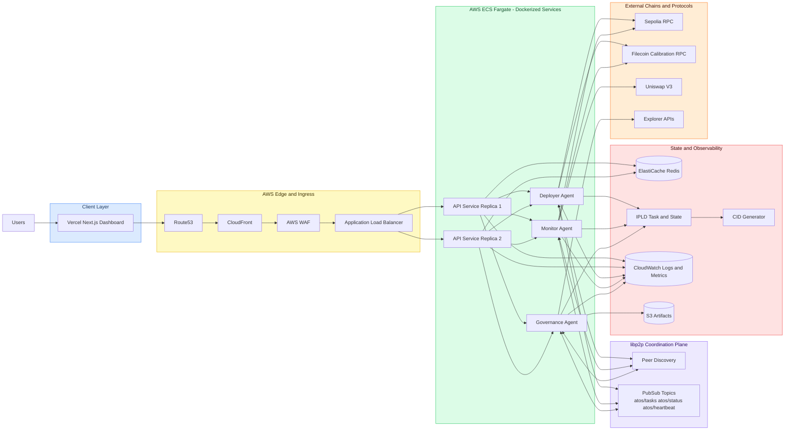
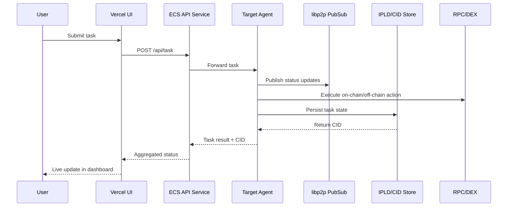

# ATOS Scalable System Architecture

```mermaid
flowchart LR
    U[Users]

    subgraph FE[Client Layer]
        V[Vercel Next.js Dashboard]
    end

    subgraph EDGE[AWS Edge and Ingress]
        R53[Route53]
        CF[CloudFront]
        WAF[AWS WAF]
        ALB[Application Load Balancer]
    end

    subgraph APP[AWS ECS Fargate - Dockerized Services]
        API1[API Service Replica 1]
        API2[API Service Replica 2]
        D[Deployer Agent]
        M[Monitor Agent]
        G[Governance Agent]
    end

    subgraph P2P[libp2p Coordination Plane]
        DISC[Peer Discovery]
        TOPIC[PubSub Topics\natos/tasks atos/status atos/heartbeat]
    end

    subgraph DATA[State and Observability]
        REDIS[(ElastiCache Redis)]
        IPLD[IPLD Task and State]
        CID[CID Generator]
        CW[(CloudWatch Logs and Metrics)]
        S3[(S3 Artifacts)]
    end

    subgraph EXT[External Chains and Protocols]
        ETH[Sepolia RPC]
        FIL[Filecoin Calibration RPC]
        DEX[Uniswap V3]
        EXP[Explorer APIs]
    end

    U --> V
    V --> R53 --> CF --> WAF --> ALB
    ALB --> API1
    ALB --> API2

    API1 --> D
    API1 --> M
    API1 --> G
    API2 --> D
    API2 --> M
    API2 --> G

    D <--> DISC
    M <--> DISC
    G <--> DISC
    D <--> TOPIC
    M <--> TOPIC
    G <--> TOPIC

    API1 --> REDIS
    API2 --> REDIS
    D --> IPLD
    M --> IPLD
    G --> IPLD
    IPLD --> CID
    G --> S3

    D --> ETH
    M --> ETH
    D --> FIL
    M --> FIL
    M --> DEX
    G --> EXP

    API1 --> CW
    API2 --> CW
    D --> CW
    M --> CW
    G --> CW

    style FE fill:#dbeafe,stroke:#3b82f6,color:#1e3a5f
    style EDGE fill:#fef9c3,stroke:#eab308,color:#3f3000
    style APP fill:#dcfce7,stroke:#22c55e,color:#14532d
    style P2P fill:#ede9fe,stroke:#8b5cf6,color:#2e1065
    style DATA fill:#fee2e2,stroke:#ef4444,color:#450a0a
    style EXT fill:#ffedd5,stroke:#f97316,color:#431407
```

## Request Flow (Task Lifecycle)

```mermaid
sequenceDiagram
    participant User
    participant UI as Vercel UI
    participant API as ECS API Service
    participant Agent as Target Agent
    participant P2P as libp2p PubSub
    participant Store as IPLD/CID Store
    participant Chain as RPC/DEX

    User->>UI: Submit task
    UI->>API: POST /api/task
    API->>Agent: Forward task
    Agent->>P2P: Publish status updates
    Agent->>Chain: Execute on-chain/off-chain action
    Agent->>Store: Persist task state
    Store-->>Agent: Return CID
    Agent-->>API: Task result + CID
    API-->>UI: Aggregated status
    UI-->>User: Live update in dashboard
```

