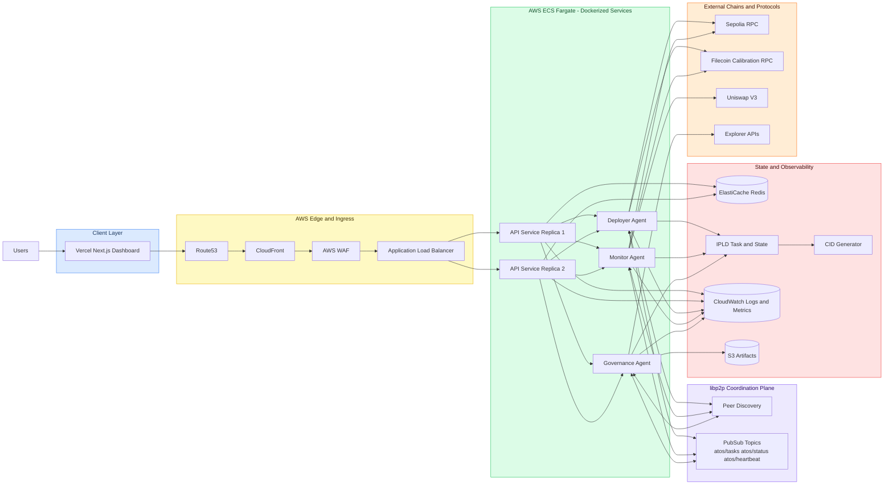
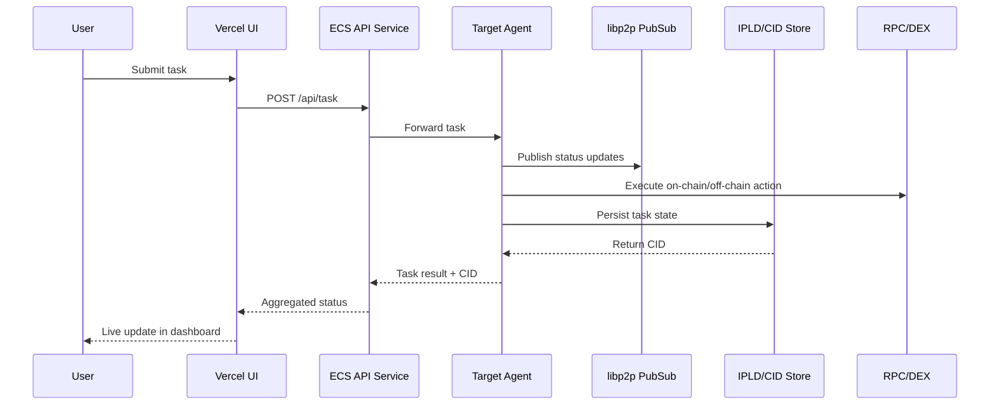

# ATOS — Autonomous Token Orchestration System

Research PoC: orchestrate an ERC-20 token lifecycle (deploy → monitor → DEX/CEX prep) with **Rust libp2p agents**, a **Next.js operator dashboard** (Privy), and **Foundry** contracts on **Sepolia** and **Filecoin Calibration**.

| Layer | Path | Stack |
| --- | --- | --- |
| Contracts | `contracts/` | Solidity, Foundry, OpenZeppelin |
| Agents | `agents-rust/` | Rust, libp2p (gossipsub, mDNS), Axum HTTP API |
| Dashboard | `apps/web/` | Next.js 14, Privy, Wagmi, viem |

---

## Prerequisites

- **Rust** 1.75+ (`rustup`) — agents
- **Node** 20+ and **pnpm** 8+ — dashboard
- **Foundry** (`forge`, `cast`) — contracts
- **Docker** (optional) — full stack via `docker-compose.yml`

Copy env templates before running:

- `apps/web/.env.example` → `apps/web/.env.local`
- `contracts/.env.example` → `contracts/.env` (for deploy scripts)

---

## Quick start (Docker)

Runs all three agents + the web UI. Set `NEXT_PUBLIC_PRIVY_APP_ID` (and optional contract vars) in your shell or a repo-root `.env` file before compose.

```bash
docker compose up --build
```

Open http://localhost:3000

Fault-tolerance demo: `docker compose stop atos-monitor` → dashboard shows offline → `docker compose start atos-monitor`.

---

## Build and run (local)

### 1) Contracts

```bash
cd contracts
forge build
forge test
```

Deploy example (Sepolia; configure RPC + account in `contracts/.env`):

```bash
forge script script/DeployATOSToken.s.sol:DeployATOSToken --rpc-url sepolia --broadcast
```

Filecoin Calibration deploy notes (FEVM gas, `forge create`, opcode pins): [FILECOIN_CALIBRATION_DEPLOY_CHALLENGES.md](./FILECOIN_CALIBRATION_DEPLOY_CHALLENGES.md)

Uniswap V3 pool on Sepolia: [contracts/script/uniswap/README.md](./contracts/script/uniswap/README.md)

### 2) Rust agents (three terminals)

From `agents-rust/`:

```bash
cd agents-rust
cargo build -p atos-agent --release
```

| Role | API | libp2p TCP |
| --- | --- | --- |
| deployer | `3001` | `4001` |
| monitor | `3002` | `4002` |
| governance | `3003` | `4003` |

```bash
# terminal 1
cargo run -p atos-agent -- --role deployer   --port 4001 --api-port 3001

# terminal 2
cargo run -p atos-agent -- --role monitor    --port 4002 --api-port 3002

# terminal 3
cargo run -p atos-agent -- --role governance --port 4003 --api-port 3003
```

If mDNS discovery is flaky, pass bootstrap on monitor/governance, e.g. `--bootstrap /ip4/127.0.0.1/tcp/4001`.

Health check:

```bash
curl -s http://127.0.0.1:3001/status | jq .
```

Submit a task:

```bash
curl -s -X POST http://127.0.0.1:3001/task \
  -H 'Content-Type: application/json' \
  -d '{"action":"deploy_token","chain":"sepolia"}' | jq .
```

Gossipsub topics: `atos/tasks`, `atos/status`, `atos/heartbeat`.

### 3) Web dashboard

```bash
cd apps/web
pnpm install
cp .env.example .env.local   # Privy app id, RPC URLs, agent URLs
pnpm dev
```

Open http://localhost:3000 — sign in with Privy, confirm agent cards go online, submit tasks from the form.

Server-only agent URLs (not exposed to the browser):

```env
DEPLOYER_AGENT_URL=http://localhost:3001
MONITOR_AGENT_URL=http://localhost:3002
GOVERNANCE_AGENT_URL=http://localhost:3003
```

Production build: `pnpm build && pnpm start`. Vercel settings: see [apps/web/README.md](./apps/web/README.md).

---

## Documentation

| Doc | Description |
| --- | --- |
| [apps/web/README.md](./apps/web/README.md) | Dashboard architecture, diagrams, token factory, DEX, API routes |
| [CEX_LISTING_WORKFLOW.md](./CEX_LISTING_WORKFLOW.md) | End-to-end CEX listing pipeline (7 phases, IPLD listing package) |
| [FILECOIN_CALIBRATION_DEPLOY_CHALLENGES.md](./FILECOIN_CALIBRATION_DEPLOY_CHALLENGES.md) | Filecoin FEVM deploy issues and fixes |
| [DEPLOYMENT_STRATEGY.md](./DEPLOYMENT_STRATEGY.md) | Vercel + AWS ECS production layout and cost model |
| [project_information.md](./project_information.md) | Original project goals and acceptance criteria |

---

## Target production architecture

The PoC runs locally or via Docker. The diagram below is the **scale target** (Vercel UI + AWS ECS agents).



### Request flow (task lifecycle)



---

## Scope

**In scope:** testnets, multi-agent mesh, dashboard control plane, CEX metadata stub + documented listing pipeline, in-memory CID store.

**Out of scope:** mainnet, real CEX listing, production compliance, full PQC-secured libp2p transport.
