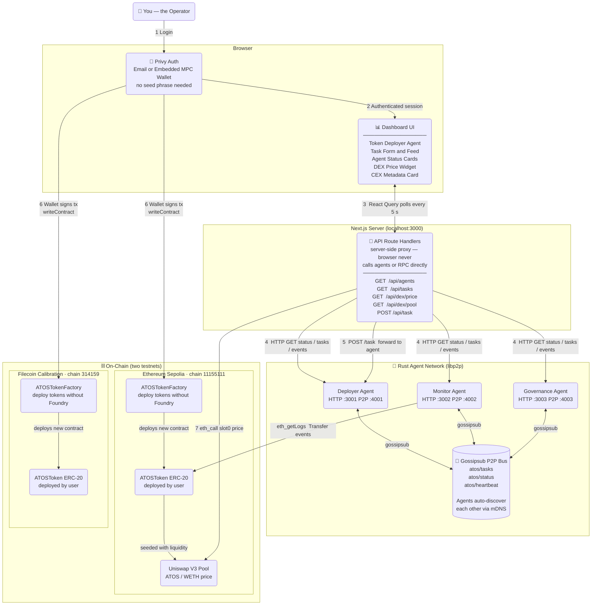
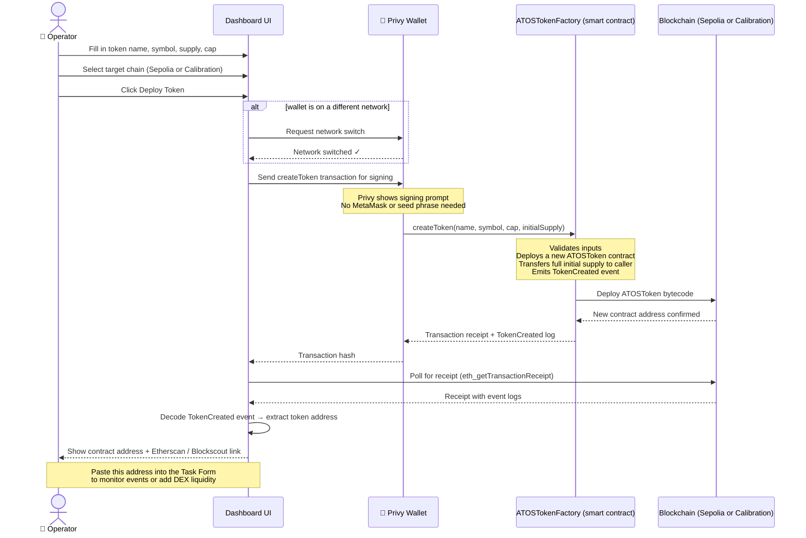
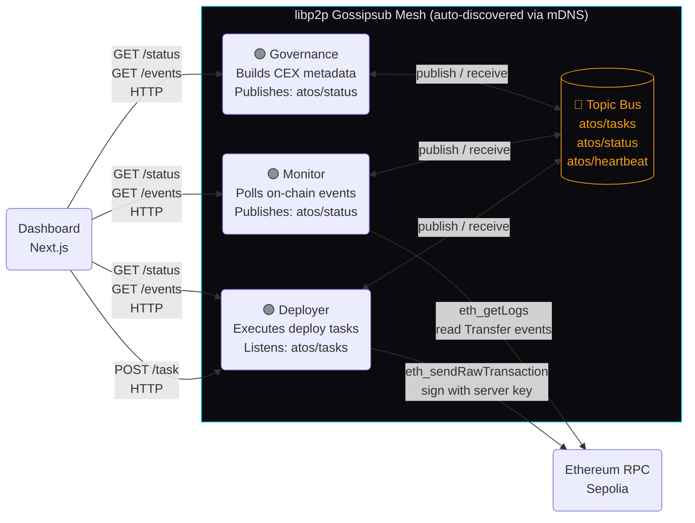

# @atos/web

Operator console for the **ATOS — Autonomous Token Orchestration System** research PoC.

A Next.js 14 (App Router) dashboard that:

- authenticates operators with Privy (email + wallet, MPC embedded wallets auto-created),
- talks to three local libp2p agent daemons (`deployer` / `monitor` / `governance`),
- submits and observes tasks flowing through gossipsub (`atos/tasks`, `atos/status`, `atos/heartbeat`),
- reads a Uniswap V3 pool slot0 on Sepolia for the ATOS/WETH DEX price (or returns a clearly-flagged `MOCKED` payload when no pool is configured),
- displays the latest governance-produced CEX metadata artifact with its CID.

The UI follows a terminal / operator-console aesthetic — dark base, electric cyan accents, mono type for every hash and peerId.

---

## Architecture

> **Tip:** paste either diagram block into **[mermaid.live](https://mermaid.live)** to render and download a PNG / SVG.

### Diagram 1 — System Overview

Shows every layer of the system and how they talk to each other.



---

### Diagram 2 — Token Deployment Flow (step by step)

Shows exactly what happens when you click **Deploy Token** in the dashboard.



---

### Diagram 3 — P2P Agent Mesh (how agents communicate)

Shows how the three Rust agents discover each other and share messages without a central server.



---

## Install

```bash
cd apps/web
pnpm install
```

Requires Node ≥ 20 and pnpm ≥ 8.

## Env

Copy `.env.example` to `.env.local` and fill in:

```env
NEXT_PUBLIC_PRIVY_APP_ID=your-privy-app-id
NEXT_PUBLIC_CHAIN_ID=11155111
NEXT_PUBLIC_CONTRACT_ADDRESS=0x...            # deployed ATOSToken
NEXT_PUBLIC_DEX_POOL_ADDRESS=0x...            # optional; leave blank for MOCKED price
NEXT_PUBLIC_ETH_RPC_URL=https://...           # public Sepolia RPC
NEXT_PUBLIC_FIL_RPC_URL=https://api.calibration.node.glif.io/rpc/v1

# Server-only (used by route handlers; never sent to the browser)
DEPLOYER_AGENT_URL=http://localhost:3001
MONITOR_AGENT_URL=http://localhost:3002
GOVERNANCE_AGENT_URL=http://localhost:3003
```

`NEXT_PUBLIC_*` values are exposed to the client at build time. The three
`*_AGENT_URL` values are read **only** by the Next.js route handlers and are
never bundled into client code.

## Dev

```bash
pnpm dev
```

then open <http://localhost:3000>.

## Testing against local agents

The console expects three Rust agent daemons running locally:

| role        | API port | TCP (libp2p) |
| ----------- | -------- | ------------ |
| deployer    | `3001`   | `4001`       |
| monitor     | `3002`   | `4002`       |
| governance  | `3003`   | `4003`       |

Each agent must expose:

| route       | method | description                                |
| ----------- | ------ | ------------------------------------------ |
| `/status`   | GET    | `{ role, apiPort, tcpPort, peerId, connectedPeers[], connectionCount, uptimeSecs }` |
| `/task`     | POST   | accept JSON payload, returns `{ id, status, source, timestamp, payload }` |
| `/tasks`    | GET    | `{ total, tasks: TaskRecord[] }`           |
| `/events`   | GET    | `{ total, events: AgentMessage[] }`        |

From the repo root, start the Rust agents (already implemented in `agents-rust/`):

```bash
# in three terminals
cargo run -p atos-agent -- --role deployer   --port 4001 --api-port 3001
cargo run -p atos-agent -- --role monitor    --port 4002 --api-port 3002
cargo run -p atos-agent -- --role governance --port 4003 --api-port 3003
```

Then run `pnpm dev` in `apps/web/` and visit <http://localhost:3000>:

1. Click **Connect operator**, sign in via Privy (email or wallet).
2. The dashboard renders three agent cards — they should glow cyan within ~5s once `/status` responds.
3. Submit a task from the form. A new row appears in the task feed within ~4s.
4. Kill one of the agent processes; its card flips to red within ~10s. Restart it — it returns to cyan.
5. The DEX widget shows the Uniswap V3 pool price if configured, otherwise an obvious `MOCKED` badge.
6. The CEX prep card shows the latest governance `generate_cex_metadata` payload.

## Build

```bash
pnpm build
pnpm start
```

## Accessibility

- Every status uses an icon **and** text, never colour alone.
- All actionable controls are reachable via keyboard with a visible focus ring.
- `prefers-reduced-motion: reduce` disables the heartbeat pulse, edge pulses, and ticker scroll.

## Token factory (no Foundry for end users)

1. **Once per chain** — deploy the factory (operators / devs only):

   ```bash
   cd contracts
   ./script/deploy-factory-sepolia.sh
   ```

2. Set `NEXT_PUBLIC_TOKEN_FACTORY_ADDRESS_SEPOLIA` (or `_CALIBRATION`) in `apps/web/.env`.

3. On the dashboard **Token factory** card, enter **name** + **symbol**, cap, and initial supply → **Deploy token**. Your wallet signs one transaction; the new contract address is shown when confirmed.

4. Paste that address into the task form or `NEXT_PUBLIC_CONTRACT_ADDRESS` for monitoring and DEX liquidity.

`ATOSTokenFactory.createToken(name, symbol, cap, initialSupply)` deploys a capped `ATOSToken` owned by the caller.

## DEX listing & liquidity (Uniswap V3 · Sepolia)

1. Deploy ATOS on Sepolia and set `NEXT_PUBLIC_CONTRACT_ADDRESS` + `NEXT_PUBLIC_ETH_RPC_URL`.
2. **Dashboard → DEX liquidity** card:
   - **List + seed liquidity** — wallet signs wrap → approve → create pool → mint LP (same steps as `SeedUniswapV3PoolSepolia.s.sol`).
   - **Queue deployer task** — records intent on the deployer agent (gossipsub + task feed).
3. **CLI (recommended for first pool):**

   ```bash
   cd contracts
   # .env: ATOS_SEPOLIA=0x...
   ./script/uniswap/seed-pool-sepolia.sh
   ```

4. Copy the printed **Pool** address into `NEXT_PUBLIC_DEX_POOL_ADDRESS` (optional; pool is also discovered via the V3 factory).

API routes: `GET /api/dex/pool`, `GET /api/dex/price`, `POST /api/dex/liquidity/task`.

## Deploy on Vercel

This app is **Next.js**, not a static `public/` export. In the Vercel project:

| Setting | Value |
| -------- | ----- |
| **Root Directory** | `apps/web` |
| **Framework Preset** | Next.js |
| **Build Command** | `pnpm build` (default) |
| **Output Directory** | *(leave empty — do not set `public`)* |
| **Install Command** | `pnpm install` |

`apps/web/vercel.json` pins `framework: "nextjs"` so Vercel does not treat the build as a static site.

Add all variables from `.env.example` under **Project → Settings → Environment Variables**. Agent URLs (`DEPLOYER_AGENT_URL`, etc.) must point to reachable hosts in production (not `localhost` unless you tunnel).

Redeploy after changing Root Directory or clearing **Output Directory**.

## Notes

- Strict TypeScript, ESLint clean, no `any` in domain code.
- No mock data files. The only "mock" path is the DEX price endpoint, and it is
  explicitly flagged with `{ mocked: true, reason }`.
- Agent URLs are server-side env vars; the browser never speaks to agent APIs
  directly. All traffic flows through `/api/*` route handlers.
